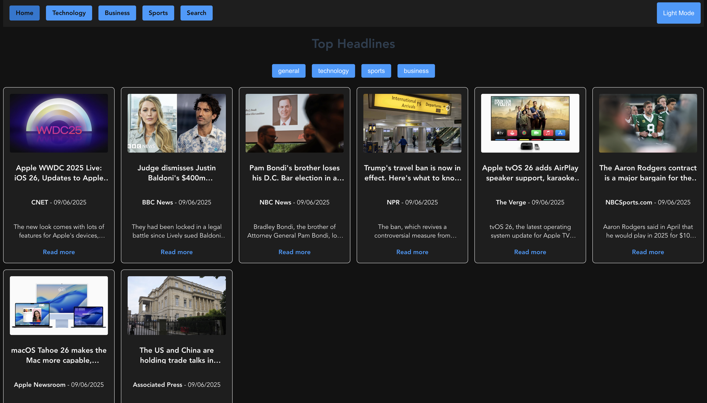
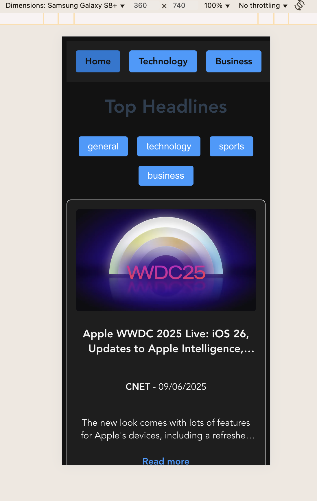

# news-aggragator-1

## Project setup
```
pnpm install
```

### Compiles and hot-reloads for development
```
pnpm run serve
```

### Compiles and minifies for production
```
pnpm run build
```

### Run your unit tests
```
pnpm run test:unit
```

### Lints and fixes files
```
pnpm run lint
```

### Customize configuration
See [Configuration Reference](https://cli.vuejs.org/config/).


##  Design Decisions

- **Vue 2** was chosen for this assignment .
- Components were broken down by concern (Card, Pagination, Pages).
- Global SCSS handles layout and theme, with dark mode via `body.dark-mode`.
- Routing is handled by `vue-router`; 

##  Trade-offs / Assumptions

- Assumes modern Chromium browsers for memory monitoring (performance.memory).
- If image not present showing the alt text.
- Used pagination logic.

## Screenshots

### Desktop




### Mobile



## 🚀 Performance Optimizations

- **Lazy loading images**: Reduces initial network cost using `loading="lazy"`.
- **Dark mode with CSS vars**: Avoids full DOM reflow, only color values change.
- **Debounced search input**: Limits API calls for every keystroke.
- **Scoped styles and grid layouts**: Ensures clean DOM updates.


## 🚀 Netlify link

- **URL**: https://newsaggregatorvue.netlify.app/  (currently api giving 426 because of api key im using, it works only for localhost).
- 
##  Self-Assessment

###  Functionality
All core features have been implemented: category-based top headlines, full search functionality using the NewsAPI, sorting by newest and relevance, pagination, and dark mode. Proper error handling ensures that the user is informed in case of API issues or empty states.

### Code Quality
The code follows Vue 2 best practices with clean separation of concerns. Components are reusable and scoped. API logic is abstracted into a service layer. Pagination and cards are implemented as isolated components to reduce repetition and improve maintainability.

###  Performance Optimization
Pagination limits the number of DOM elements rendered. Images are lazy-loaded and have alt text or we can have placeholders. Search input is debounced to reduce API calls. State is scoped to avoid unnecessary re-renders. CSS variables are used for efficient dark mode toggling.

###  User Experience (UX)
The UI is responsive and mobile-friendly. Buttons have hover states. The layout is clean and consistent with clear navigation between pages. Dark mode improves accessibility, and visual feedback is provided for loading and pagination states.

###  Technical Design
Logical file and component structure using Vue CLI. Pages are route-based and support deep linking. Global styles and variables are centralized. Custom hook logs memory usage to detect potential issues during development. Easy to scale and extend further.

